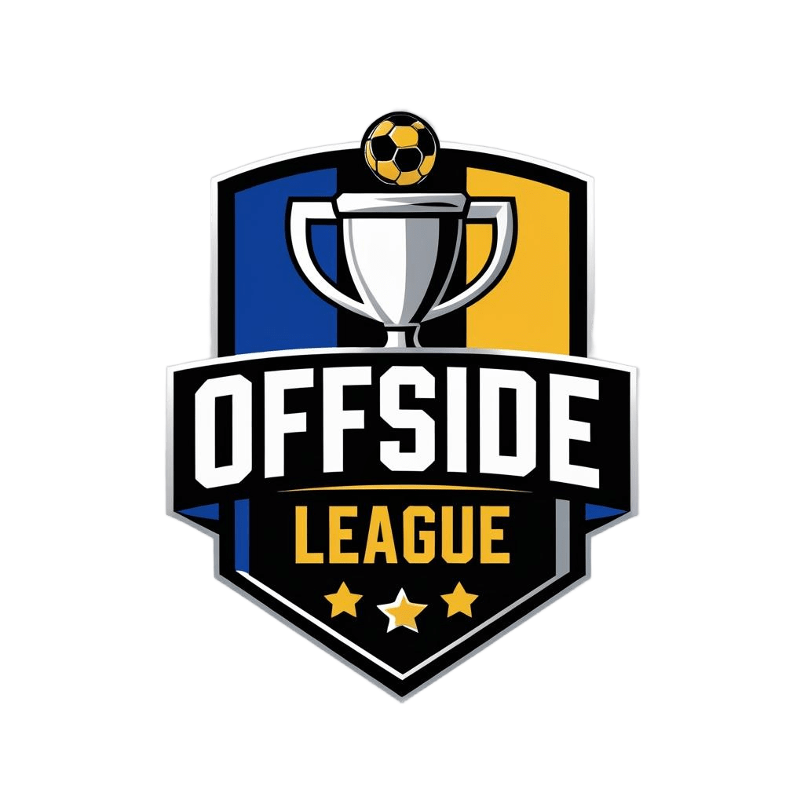

# ⚽ Offside — Football League Manager

A cross-platform Flutter app for creating and managing local football leagues. Track teams, players, match schedules, live events, and standings — all stored offline on-device.

---

| Matches | League Detail | Match Events | Player Profile |
|---------|--------------|--------------|----------------|
|  |  | — | — |

---

## ✨ Features

- **League Management** — Create custom leagues with a name and logo
- **Team Builder** — Add teams with logos chosen from a built-in set
- **Player Roster** — Add players to each team before fixtures are generated
- **Auto Fixture Generation** — Automatically generates a round-robin schedule (every team plays every other team)
- **Date & Time Scheduling** — Pick a date and time for each fixture
- **Live Match Scoring** — Tap a player to record: Goal, Assist, Yellow Card, Red Card, Shot, Substitution, Offside, Corner Kick, Free Kick
- **Standings Table** — Automatically calculated from match results (W/D/L, GF, GA, GD, Pts)
- **Top Scorers & Assists** — Per-league leaderboards
- **Player Stats** — Full individual stats: goals, assists, shots, passes, yellow/red cards, appearances
- **Match Timeline** — Visual event-by-event timeline for each match
- **Search** — Search players, teams, and leagues across the app
- **Date Filter** — Browse all matches by day on the home screen
- **Offline-First** — All data persists locally using Hive (no internet required)

---

## 🗂️ Project Structure

```
lib/
├── main.dart                     # App entry point & Hive initialization
├── splash_screen.dart            # Splash screen → Sign In
├── navbar.dart                   # Bottom navigation shell (OffsideShell)
│
├── pages_sign/
│   ├── sign_in.dart              # Login page
│   └── sign_up.dart              # Register page
│
├── pages_add/
│   ├── add_league.dart           # Step 1: Create a league
│   ├── add_team.dart             # Step 2: Add teams
│   ├── add_player.dart           # Step 3: Add players to a team
│   ├── add_matches.dart          # Step 4: Auto-generate & schedule fixtures
│   └── add_Score_match.dart      # Live match: record goals, cards, events
│
├── pages_navbar/
│   ├── matchs.dart               # Home tab: matches filtered by date
│   ├── analysis.dart             # Analysis tab: leagues & teams overview
│   ├── players.dart              # Players tab: searchable player list
│   └── profile.dart              # Profile tab: settings & cache management
│
├── pages_details/
│   ├── details_league.dart       # League: matches, standings, top scorers/assists
│   ├── details_team.dart         # Team: matches, standings, players
│   ├── details_match.dart        # Match: score + full event timeline
│   └── details_player.dart       # Player: profile card + full statistics
│
└── models/
    ├── leage_model.dart          # League model + standings & top scorers logic
    ├── team_model.dart           # Team model
    ├── match_model.dart          # Match model
    ├── player_model.dart         # Player model
    └── event_model.dart          # Match event model (goal, card, etc.)
```

---

## 🔄 App Flow

```
SplashScreen (3s)
    └── SignIn / SignUp
            └── OffsideShell (Bottom Nav)
                    ├── 🏟️  Matches     — Browse today's matches, filter by date
                    ├── 📊  Analysis    — View all leagues and teams
                    ├── 👤  Players     — Search all players across leagues
                    ├── ⚙️  Profile     — Settings, clear cache
                    └── ➕  FAB Button
                            └── Create League
                                    └── Add Teams
                                            └── Add Players
                                                    └── Generate Fixtures
                                                            └── League Page
```

---

## 🛠️ Tech Stack

| Technology | Purpose |
|---|---|
| [Flutter](https://flutter.dev) | UI framework |
| [Dart](https://dart.dev) | Programming language |
| [Hive](https://pub.dev/packages/hive_flutter) | Local offline database |
| [hive_generator](https://pub.dev/packages/hive_generator) | Auto-generates Hive type adapters |
| [build_runner](https://pub.dev/packages/build_runner) | Code generation tool |
| [flutter_svg](https://pub.dev/packages/flutter_svg) | SVG icon rendering |
| [intl](https://pub.dev/packages/intl) | Date/time formatting |

---

## 🚀 Getting Started

### Prerequisites

- Flutter SDK `>=3.0.0`
- Dart SDK `>=3.0.0`
- Android Studio / VS Code with Flutter plugin

### Installation

```bash
# 1. Clone the repository
git clone https://github.com/MarwaaMuhammad/offside.git
cd offside

# 2. Install dependencies
flutter pub get

# 3. Generate Hive adapters (only needed if models change)
flutter packages pub run build_runner build

# 4. Run the app
flutter run
```

### Build for release

```bash
# Android APK
flutter build apk --release

# iOS (requires macOS + Xcode)
flutter build ios --release
```

---

## 🗄️ Data Models

### `League`
| Field | Type | Description |
|---|---|---|
| `name` | `String` | League name |
| `logo` | `String` | Asset path to league logo |
| `teams` | `List<Team>` | All teams in this league |
| `matches` | `List<Match2>` | All fixtures |
| `topScorers` | `List<Player>?` | Cached top scorers list |
| `topAssistants` | `List<Player>?` | Cached top assistants list |

### `Team`
| Field | Type | Description |
|---|---|---|
| `name` | `String` | Team name |
| `logo` | `String` | Asset path to team logo |
| `players` | `List<Player>` | Squad players |
| `points` | `int?` | League points |
| `wins/draw/losses` | `int?` | Match results |
| `goalsFor/goalsAgainst` | `int?` | Goals statistics |

### `Player`
| Field | Type | Description |
|---|---|---|
| `name` | `String` | Full name |
| `position` | `String` | Playing position |
| `age` | `int` | Age |
| `nationality` | `String` | Nationality |
| `number` | `int` | Jersey number |
| `goals/assists/shots/passes` | `int` | Performance stats |
| `yellowCards/redCards` | `int` | Disciplinary stats |
| `appearances` | `int` | Matches played |

### `Match2`
| Field | Type | Description |
|---|---|---|
| `homeTeam / awayTeam` | `Team` | Competing teams |
| `date` | `DateTime` | Scheduled date and time |
| `homeTeamScore / awayTeamScore` | `int?` | Final score |
| `eventsHome / eventsAway` | `List<Event>` | Match events per team |
| `status` | `String?` | Match status label |

### `Event`
| Field | Type | Description |
|---|---|---|
| `type` | `String` | Event type (Goal, Yellow Card, etc.) |
| `player` | `String` | Player name involved |
| `minute` | `int` | Minute the event occurred |
| `assist` | `String?` | Assisting player name (for goals) |

---

## 📊 Standings Logic

The standings are computed fresh each time via `League.updateStandings()`:

1. All team stats are reset to zero
2. Every completed match (with a score) is iterated
3. Points are awarded: **Win = 3pts**, **Draw = 1pt**, **Loss = 0pts**
4. Teams are sorted by: Points → Goal Difference → Goals For → Name (alphabetical)

Rank colors follow UEFA convention:
- 🟢 Green — Top 4 (Champions League zone)
- 🔵 Blue — 5th–6th (Europa League zone)
- 🔴 Red — Bottom 3 (Relegation zone)

---

## 🎨 Design

- **Color scheme:** Dark navy (`#0D1956`, `#16246E`) with white text and accent highlights
- **Font:** Cairo (Bold & Regular) — set in `pubspec.yaml`
- **Icons:** Custom SVG icons for the bottom navigation bar
- **Logos:** 8 league logos and 20 team logos included as local assets

---

## 🤝 Contributing

Contributions are welcome! To contribute:

1. Fork the repository
2. Create a feature branch: `git checkout -b feature/your-feature`
3. Commit your changes: `git commit -m 'Add your feature'`
4. Push to your branch: `git push origin feature/your-feature`
5. Open a Pull Request

---

## 📄 License

This project is open source. See [LICENSE](LICENSE) for details.

---
